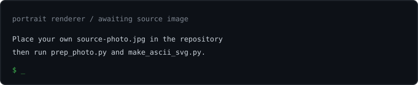
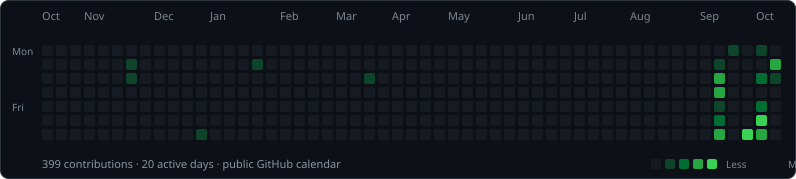

<h1>Dipesh Sapkota</h1>

<code>computer-engineering-student@thapathali:~$ whoami</code>

<a href="https://www.dipeshsapkota7.com.np/">Portfolio</a> · <a href="https://github.com/Dszae">GitHub</a> · <a href="https://linkedin.com/in/dszae">LinkedIn</a>

About this profile

Computer Engineering student at Thapathali Campus, Institute of Engineering (IOE), Nepal. I enjoy programming, web development, video editing, motion graphics, and creative technology.

**Tools:** C, C++, Python, JavaScript, React, PHP, Tailwind CSS, Vite · Premiere Pro, After Effects, DaVinci Resolve, Figma, Photoshop · Proteus and circuit analysis

**Selected projects:** [Sportivo](https://sportivo.dipeshsapkota7.com.np/) · [IOE Admission Hub](https://ioe-admission.dipeshsapkota7.com.np/) · [Git Visualizer](https://git-visualizer.dipeshsapkota7.com.np/)

**Elsewhere:** [Instagram](https://instagram.com/dsz.ae) · [Facebook](https://facebook.com/dsz.ae) · [TikTok](https://tiktok.com/@dsz.ae) · [Email](mailto:dsz.ae18@gmail.com)

<h3><code>git log --all --oneline --graph -- contributions</code></h3>

<!-- Profile art is generated by .github/workflows/update-profile-art.yml. -->
